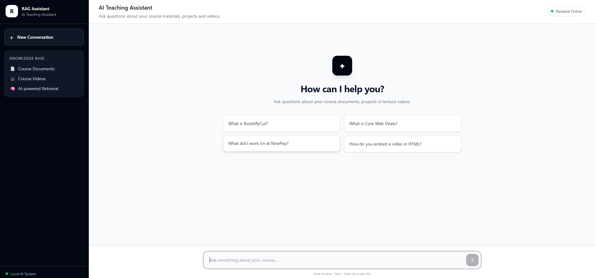

# 🎓 RAG-Based AI Teaching Assistant

An AI-powered Teaching Assistant built using **Retrieval-Augmented Generation (RAG)** to answer questions from course documents and lecture videos.

The system combines **hybrid retrieval, reranking, and local LLM inference** to provide grounded answers with source information.

---

## 📸 Application



---

## 🚀 Features

- 📄 **PDF / Document Question Answering**
- 🎥 **Video Lecture Understanding** using Whisper
- 🔎 **Hybrid Search** — semantic + keyword retrieval
- 🎯 **Reranking** for improved relevance
- 🧠 **Local LLM** using Llama 3.2 + Ollama
- 📚 **Source-aware answers** with document pages and video timestamps
- 📊 **Retrieval evaluation** using Hit Rate@5 and MRR@5
- 💻 **React + Tailwind CSS frontend**
- ⚡ **Express.js REST API**

---

## 🏗️ Architecture

```text
PDFs / Videos
     │
     ▼
Text Extraction + Whisper
     │
     ▼
Chunking + Metadata
     │
     ▼
BGE-M3 Embeddings
     │
     ▼
FAISS + Hybrid Search
     │
     ▼
Reranking
     │
     ▼
Relevant Context
     │
     ▼
Llama 3.2 + Ollama
     │
     ▼
Answer + Sources
     │
     ▼
Express API
     │
     ▼
React + Tailwind UI
```

---

## 📊 Retrieval Performance

Evaluated on **30 test questions** across document and video sources.

| Method | Hit Rate@5 | MRR@5 |
|---|---:|---:|
| Dense Retrieval | 93.3% | 0.883 |
| **Hybrid + Reranking** | **96.7%** | **0.950** |

Hybrid retrieval with reranking improved both retrieval accuracy and ranking quality compared with dense-only retrieval.

---

## 🛠️ Tech Stack

### AI / RAG
- Python
- BGE-M3
- FAISS
- Hybrid Search
- Reranking
- Whisper
- Ollama
- Llama 3.2

### Backend
- Node.js
- Express.js
- REST API

### Frontend
- React.js
- Vite
- Tailwind CSS

---

## 💡 Example Questions

```text
What is BookMyCut?

What did I work on at NinePay?

What is Core Web Vitals?

How do you embed a video in HTML?

What is TALENT-IQ?
```

---

## ▶️ Run Locally

### Prerequisites

Make sure you have installed:

- Python
- Node.js
- npm
- Ollama

### 1. Start Ollama

Make sure the required models are available:

```bash
ollama pull llama3.2
ollama pull bge-m3
```

### 2. Start the Backend

From the project root:

```bash
node backend/server.js
```

The backend runs at:

```text
http://localhost:5000
```

### 3. Start the Frontend

Open another terminal:

```bash
cd frontend
npm install
npm run dev
```

The frontend will run at:

```text
http://localhost:5173
```

Open the URL in your browser and start asking questions.

---

## 📁 Project Structure

```text
rag-project/
│
├── backend/
│   └── server.js
│
├── frontend/
│   ├── src/
│   │   ├── App.jsx
│   │   ├── main.jsx
│   │   └── index.css
│   ├── package.json
│   └── vite.config.js
│
├── rag_service.py
├── retrieval.py
├── build_faiss_index.py
├── evaluate_retrieval.py
├── eval_questions.json
│
├── faiss_index.bin
├── metadata.joblib
├── metadata.json
│
└── README.md
```

---


## 🎯 Why This Project?

Unlike a basic RAG pipeline that only performs vector search, this project combines:

**Multimodal ingestion → Embeddings → Hybrid Retrieval → Reranking → LLM Generation → Source Citations → Evaluation**

The system is designed to provide answers grounded in the available course material while keeping the AI pipeline **fully local**.

---

## 👨‍💻 Author

**Ayan Dhal**

B.Tech — MNNIT Allahabad

Interested in **AI/ML, RAG Systems, Backend Development and Software Engineering**.